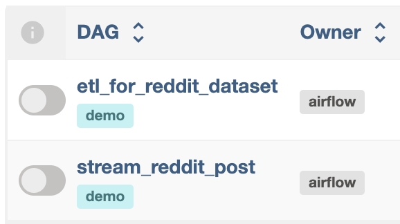

# demo_project
This is a demo project ETL project using postgreSQL, Apache Airflow, Confluent, dbt and PySpark.
The project demostrates two use cases.


## First use case
Grep data from WeatherAPI, transform the data and store in data warehouse.
This pipeline is trigger by restAPI.


Tasks are following the below steps:
1. Get the input postal code from the API trigger
1. Trigger the python script to get the WeatherAPI data, break down into tables and write to PostgreSQL in the bronze schema
1. Data test on unique key and non-nullable columns by dbt
1. Transform the data into correct data type in silver schema by dbt

## Second use case
Extract reddit post and stream to kafka topic to mimic streaming. Consume the topic using spark structure streaming and write the data in data warehouse. Finally transform the data.



There are two airlfow dags in this use case.

`get_reddit_post` is to mimic streaming the reddit data to kafka, it is scheduled to run every 10 mins. Behind the scene, it runs a python script to call the reddit api and publish the data to the kafka topic.

The notebook `pyspark/pyspark_kafka.ipynb` consumes the topic `kafka`, enforces the datatypes and writes the data to Postgres.

`etl_for_kafka_dataset` simply triggers the dbt run to load the data to silver incrementally.


## Prerequisite
1. Spark, Python and PySpark should be installed on your local machine. Please refer to the below link for MacOS.
https://sparkbyexamples.com/pyspark/how-to-install-pyspark-on-mac/

1. Get a key from WeatherAPI https://www.weatherapi.com/
1. Get a client id and secret from reddit https://reddithelp.com/hc/en-us/requests/new?ticket_form_id=14868593862164


## Quickstart

### Set up
1. Update the keys created above in `scripts/config.ini`

1. Spin up docker containers
   open a terminal and execute the below command
   ```
   # containers for airflow, postgreSQL and dbt
   cd demo_project
   docker compose up -d

   # containers for confluent kafka cluster
   cd kafka
   docker compose up -d
   ```
   After a while, services will be up and running.
   You can list the container using command `docker ps`

   The service are spinned up after a while.

   - Airflow:    http://localhost:8080/

      Note that the username and password are **airlfow**
      

   - Confluent:  http://localhost:9021/
      

   - PostgreSQL: jdbc:postgresql://localhost:5432/

      


1. Create database and schema
   ```
   # sh
   docker exec -it demo_project-postgres-1 psql -U airflow

   # sql
   CREATE DATABASE demo_project;

   \c demo_project

   CREATE SCHEMA bronze;
   CREATE SCHEMA silver;
   CREATE SCHEMA gold;

   exit
   ```

1. Create kafka topic
   Go the Confluent UI and creat a topic named **reddit**

### Use case 1
1. Trigger dag `demo_etl`
   - Go to Airflow UI and trigger the dag `demo_etl` with config. Default postal code will be **M2M** if triggering without config.
      
   
   - Or use an API call to trigger the dag run
      ```
      #sh
      curl -X 'POST' \
      'http://localhost:8080/api/v1/dags/demo_etl/dagRuns' \
      -u airflow:airflow \
      -H 'accept: application/json' \
      -H 'Content-Type: application/json' \
      -d '{
      "conf": {"postal_code":"T2J"}
      }'
      ```

1. Check result in Postgre
   ```
   SELECT * FROM silver.location;
   SELECT * FROM silver.astro;
   SELECT * FROM silver.daily_forecast;
   SELECT * FROM silver.hourly_forecast;
   SELECT * FROM silver.weather_history;
   ```

### Use Case 2
1. Start dag `get_reddit_post`
1. Go to Confluent Kafka, and see if there is new message topic `reddit`
1. Run notebook `pyspark/pyspark_kafka.ipynb`
1. Start dag `etl_for_kafka_dataset`
1. Check result in Postgre
   `SELECT * FROM silver.kafka;`