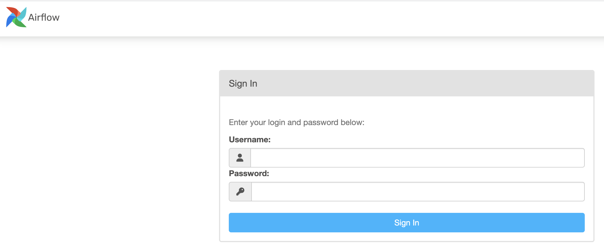

### demo_project
This is a demo project ETL project using postgreSQL, Apache Airflow, Confluent, dbt and PySpark.
The project demostrates two use cases.

1. Grep data from WeatherAPI, transform the data and store in data warehouse
1. Extract reddit post and stream to kafka topic to mimic streaming. Consume the topic using spark structure streaming and write the data in data warehouse. Finally transform the data using dbt.

## Quickstart

# Prerequisite
1. Spark, Python and PySpark should be installed on your local machine. Please refer to the below link for Mac.
https://sparkbyexamples.com/pyspark/how-to-install-pyspark-on-mac/

1. Get a key from WeatherAPI https://www.weatherapi.com/
1. Get a client id and secret from reddit https://reddithelp.com/hc/en-us/requests/new?ticket_form_id=14868593862164


# Docker containers

1. Update the keys created above in `scripts/config.ini`

1. Spin up docker containers
open a terminal and execute the below command
```
# containers for airflow, postgreSQL and dbt
cd demo_project
docker compose up -d

# containers for confluent kafka cluster
cd kafka
docker compose up -d

```
After a while, services will be up and running.
You can list the container using command `docker ps`

The service are spinned up after a while.
Airflow:    http://localhost:8080/
Note that the username and password are **airlfow**


Confluent:  http://localhost:9021/


PostgreSQL: jdbc:postgresql://localhost:5432/


1. Create database named demo_project
`CREATE DATABASE demo_project;`

1. Create schemas
```
CREATE SCHEMA demo_project.bronze;
CREATE SCHEMA demo_project.silver;
```

